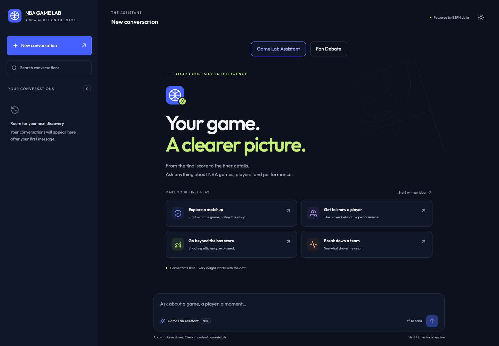

# HoopDebate

An English-language assistant for NBA fans who want to explore games, check player
statistics and honors, and compare players across seasons or careers. It retrieves
ESPN game data and NBA historical data and shows the tools used for each answer.
**Fan Debate is the project’s signature feature:** an AI rival fan that researches
evidence, challenges your basketball arguments, and checks its claims before replying.



## How to use

1. Configure a Google Cloud project with billing and Vertex AI access, then run
   `gcloud auth application-default login` (with your default project configured).
2. Build the interface: `cd frontend && npm ci && npm run build`, then `cd ..`.
3. Run `uv run app.py` and open <http://localhost:8000>.
4. Choose **Assistant**, type a question in English, and send it. Expand **Thinking**
   to inspect tool inputs and results. Continue the conversation with follow-up questions.

For games, give a date and team; for historical comparisons, give the players,
seasons, and metrics. A season starts in the named year: 2023 means 2023–24.
Missing data is reported as unavailable, and comparisons do not determine an overall winner.

## Assistant tools

Each tool below is available in Assistant. Historical query and comparison tools
are also reused by Debate; debate planning, argument auditing, and submission stay
in the Debate workflow.

### Games and display

| Tool | What it does |
| --- | --- |
| `find_games` | Finds games and their IDs by date and optional team. |
| `game_info` | Returns game start time and participating teams. |
| `game_status` | Reports game state, period, and clock. |
| `game_score` | Returns full-game or individual-period scores. |
| `team_game_info` | Reports a team's home/away designation and winner flag. |
| `team_game_stats` | Retrieves a team's single-game box-score statistics. |
| `team_game_leader` | Retrieves a team's game leader for a statistical category. |
| `player_info` | Retrieves a player's profile and headshot from a game. |
| `player_game_status` | Reports starter, absence, and ejection information. |
| `player_game_stats` | Retrieves a player's single-game box-score statistics. |
| `game_plays` | Retrieves filtered, paginated play-by-play events. |
| `player_shots` | Retrieves a player's shots, outcomes, and available coordinates. |
| `game_venue` | Returns the arena and location. |
| `game_officials` | Lists the game's officials. |
| `team_injuries` | Retrieves available injury reports with their dates. |
| `game_recap` | Retrieves the recap summary and source link. |
| `game_videos` | Retrieves available game video links. |
| `team_standings` | Retrieves team standings with the supplied season label. |
| `player_advanced_stats` | Calculates single-game player efficiency with formulas and inputs. |
| `team_advanced_stats` | Calculates single-game team efficiency and estimated ratings. |
| `game_players` | Lists players, teams, IDs, and did-not-play status in a game. |
| `display_panel` | Displays a final player or team panel using already retrieved data. |

### Historical data and comparisons

| Tool | What it does |
| --- | --- |
| `resolve_player` | Resolves a player name to NBA IDs independently of a game. |
| `query_evidence` | Retrieves sourced statistics, honors, game logs, or league shooting baselines. |
| `compare_players` | Compares two players' metrics over compatible season or career scopes. |
| `find_counterexamples` | Finds games meeting a numeric condition within one season. |
| `find_comparative_edges` | Reports advantages, disadvantages, and ties across a metric set. |
| `player_awards` | Retrieves a player's verified honors and winning seasons. |
| `compare_awards` | Compares two players' honors and winning seasons. |
| `query_competitive_context` | Retrieves season-specific teammate support and individual-role evidence. |
| `compare_competitive_context` | Compares selected teammates or role/support context across two players. |
| `query_performance_context` | Retrieves scoped player ranks, team offense, or opponent-split evidence. |

Data coverage varies by source and era; historical-game injury reports and standings
may reflect newer dates. Tool results preserve sources, scope, and limitations.

### Assistant Mode Example Query

Send these ten questions one at a time, in order, in the same conversation.
The sequence covers game lookups, follow-up context, player panels, advanced
statistics, shot pagination, and historical comparisons:

```text
Find the NBA game between the Cavaliers and Warriors on June 19, 2016. Tell me the final score.
```

```text
What was the score in the fourth quarter only?
```

```text
Show me LeBron James’s player profile and photo from that game. Don’t include statistics yet.
```

```text
Now add his box score to the panel, keeping the same player and game.
```

```text
What were his TS% and effective field goal percentage in that game? Show the formulas and inputs, and explain whether either calculation is estimated.
```

```text
Compare those same two metrics with Stephen Curry’s in the same game. Report any unavailable values rather than treating them as zero.
```

```text
Show LeBron’s first three shot attempts in the fourth quarter.
```

```text
Show the next three, keeping the same filters.
```

```text
Now switch to historical research. Compare LeBron and Curry’s points per game and TS% for the 2015–16 regular season. Resolve their NBA player IDs before querying.
```

```text
Compare the same players and metrics for the playoffs of that same season. Explain the scope and any missing coverage.
```

## Debate tools — the project’s signature feature

**Fan Debate turns player comparisons into an evidence-backed conversation.** You
pick your player and the AI’s player, then make your case. The AI chooses relevant
statistics, seasons, honors, and teammate context to address your argument. It
checks numerical claims against retrieved evidence and reviews the draft for
relevance and unsupported assertions before publishing a reply. It can concede a
point when the evidence favors your player; these checks do not guarantee correctness.

### How to use Fan Debate

Start a new conversation, choose **Fan Debate**, and select **Your player** and
**AI’s player**. The AI defends its selected player throughout that conversation.
Enter an opening argument, then challenge its response with follow-up questions.
Choose **Reasoned** or **Full roast** for the reply tone; both use the same evidence checks.
Expand **Thinking** to inspect tool calls, and inspect the evidence cards and
comparison results accompanying the response.

Debate reuses all ten tools in **Historical data and comparisons** above, plus
these five dedicated workflow tools:

| Tool | What it does |
| --- | --- |
| `plan_argument` | Plans the response to your argument and identifies evidence to investigate. |
| `plan_team_context_research` | Creates a research queue for team outcomes and supporting casts. |
| `research_team_context` | Executes the next batch of planned research and records coverage and gaps. |
| `audit_argument` | Checks numerical claims, scopes, and comparison directions against saved evidence. |
| `submit_argument` | Submits a draft and citations for validation before the final reply. |

### Debate Mode Example Query

For these examples, select **LeBron James** as **Your player** and **Stephen Curry**
as **AI’s player**. Try them as opening arguments or successive challenges:

```text
LeBron is a better scorer than Curry. Compare their career regular-season points per game and true shooting percentage, then defend Curry’s case.
```

```text
LeBron won with less help from his teammates than Curry did. How would you defend Curry against that argument?
```

```text
What about career honors? LeBron has more MVP and Finals MVP awards than Curry. Check their totals and winning seasons, then explain how you would still defend Curry’s case.
```

## Verification

Run `.venv/bin/python -m unittest discover -s test -t .` for offline regression tests.
These check tool behavior and mode restrictions; live answers additionally require
working Google Cloud credentials and access to the data providers.
